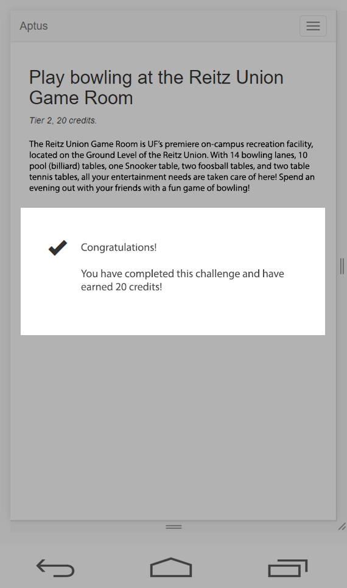
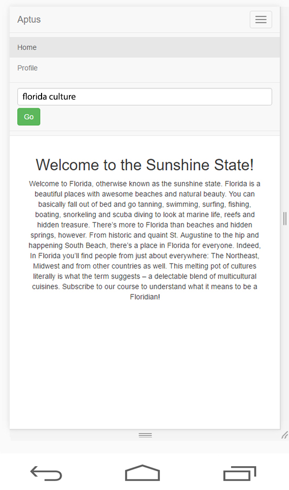

# Aptus

#### A UX prototype to mitigate culture shock.

* * *

Over a billion people travel abroad every year. You’d think the world is everyone’s oyster, but culture shock is still real, and challenges of adapting to a new culture, in a new location, very much exist. A major part of culture shock comes from the mind. Our constant need for emotional gratification, and the desire to fit in, can force us into interpreting cultural differences as alienating factors that make us feel like outsiders.  

A large part of dealing with culture shock is about mitigating the frustration that comes out of the inability to fit in. So any solution designed to make this phase easier, has to give the subject an incentive to distract themselves from frustration by looking at cultural roadblocks as little adversaries to overcome on their way to a goal, and not as personal shortcomings.  

Aptus is a minimal UX prototype that was designed after a user study on solutions to problems that arise from culture shock.  

* * *

### Design

Gamification and Gratification are the two overarching principles behind the design of the application. Gamification is achieved through tiered challenges, courses, and a points/credit system. Gratification is achieved through both gamification and social elements like sharing and collective goals.  

#### _Courses and challenges_

The app is designed in a way such that users can add their own courses and structured challenges to which other users, aware of those challenges, can contribute. For instance, a British user could create a new public course to educate users incrementally about British culture. Other British users can propose to add their knowledge to this course, which the creator of the course can review and add.  

_The homepage that shows a list of "courses" the user has subscribed to._  

 

#### _Tiered cultural challenges_

Cultural challenges can be tiered into various levels of prevalence and difficulty. Someone new to a culture barely ever faces a lot of challenges right on their first few days. It’s an incremental process where new challenges unravel themselves slowly over the course of months, or even years.  

Tier 1 challenges, or immediate challenges, are challenges that subjects might face as soon as they disembark on the new land. For instance, learning how to trade in local currency, getting used to crossing-the-road norms, queue conventions, and so on, could be immediate challenges.  

Tier 2 challenges could take the complexity a notch up. For instance, getting used to vending machines in food outlets could be a tier 2 challenge. Adapting to the banking system in the new culture could be a tier 2 challenge as well.  

_Each course page has a list of challenges required to complete the course._  

#### _Goals and gratification_

Ideally, the application would progressively, in terms of difficulty, teach users about cultural facets such that their experience of being onboarded into the new culture becomes almost seamless and, in cases, even interesting. For every new challenge overcome, or knowledge acquired, there will be a system of instant gratification in the form of in-game points, or credits with which new levels can be unlocked  

_Each challenge consists of, well, a real-life challenge that gives you points on completion._  

  

#### _Contextual awareness_

The application is also, ideally, geographically and chronologically aware. It also knows what the user’s interests are. To sum up these characteristics in a single example, if the user is a musician traveling to a new city, the application would intelligently figure out that she/he would be interested in the local music scene, and would educate her/him about local music culture and music events happening in and around the area at that time. This would be tiered appropriately, of course.  

_Search for courses based on keywords, locations, et al._  

 

#### _Catharsis through sharing_

Sharing is always endearing. _Load off my chest_, and that kind of thing. Users will be able to share their accomplishments and achievements within the app. Feeling isolated is a contributing factor to culture shock, so the ability to share mistakes and experiences, and to revel in them, makes it all the more cathartic.  

_Self-explanatory._  

